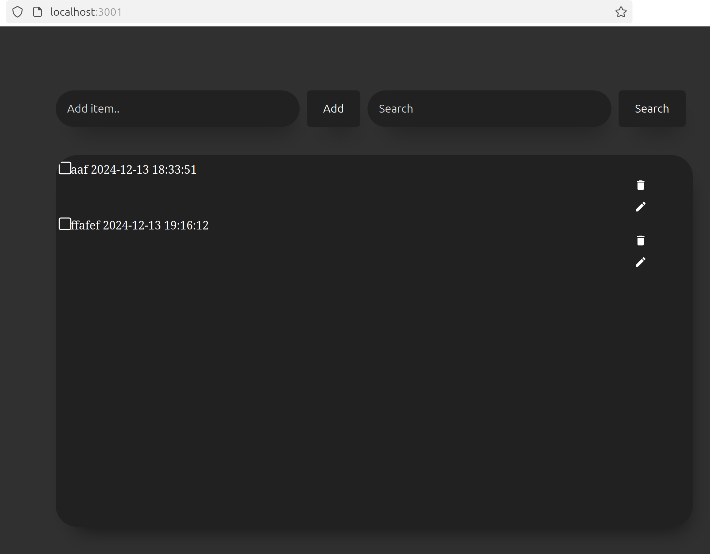

# Full-Stack To-Do List App with Rust Backend & Next.js Frontend | Rust Project

Build a Full-Stack To-Do List App with Rust Backend and Next.js Frontend

What You'll Learn:

- Setting up a Rust backend with Actix-web
- Implementing database operations using Diesel ORM
- Creating RESTful APIs in Rust
- Building a modern frontend with Next.js and React
- Fetching data from the backend using React Query
- Managing application state and UI with Next.js

## Project Overview



## Instruction

Kindly follow the following Instructions to run the project in your system and install the necessary requirements

#### INSTALL RUST

```https://nodejs.org/en/download
  RUST: curl --proto '=https' --tlsv1.2 -sSf https://sh.rustup.rs | sh
```

#### INSTALL DOC

```https://doc.rust-lang.org/book/
  RUST DOC: https://doc.rust-lang.org/book/
```

#### PROJECT STRUCTURE

```https://doc.rust-lang.org/book/
  todo_list
      ├── Cargo.toml
      └── src
          └── main.rs
```

#### BUILD & RUN COMMAND (BACKEND)

```https://doc.rust-lang.org/book/
 COMMAND:  cd rust
           cargo run
```

#### FRONTEND COMMAND

```https://doc.rust-lang.org/book/
 COMMAND:  npx run dev
```

#### INSTALL EXTENSION

```https://doc.rust-lang.org/book/
 COMMAND:  rust-analyzer
```

#### PACKAGES

```https://doc.rust-lang.org/book/
    [package]
      name = "todo-backend"
      version = "0.1.0"
      edition = "2018"

      [dependencies]
      actix-web = "4"
      actix-cors = "0.6"
      serde = { version = "1.0", features = ["derive"] }
      uuid = { version = "1.0", features = ["serde", "v4"] }
      chrono = { version = "0.4", features = ["serde"] }
```

